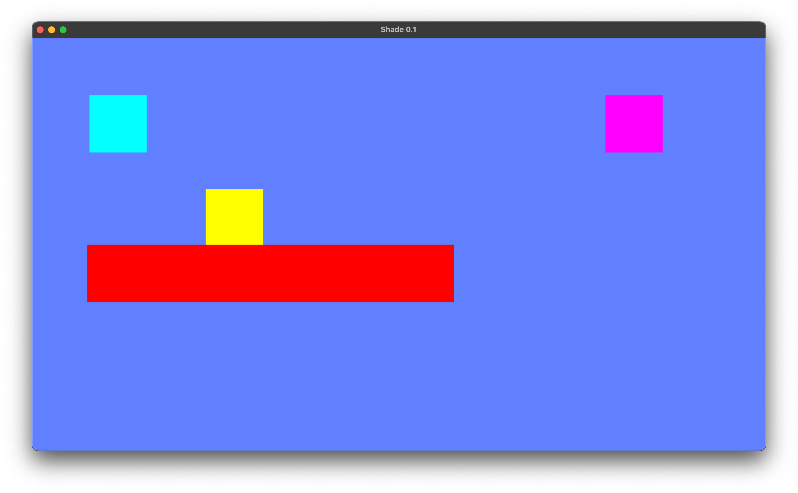

## File Structure: 

Main contains the main update loop and calls other functions to handle engine subsystems.

structs contains the application struct, which includes the SDL Renderer and SDL Window pointers.

init initializes the SDL components

input handles HID Input

draw has the functions to apply the window color, clear the renderer, and render the updated scene.

# Homework 1

## Prerequisites

- SDL2 Library
- C++14 and above

## How to run

1. To compile the code, run the following command in the terminal:``make``
2. It should create an executable named ``shade_engine``
3. To run the executable, run the following command in the terminal:``./shade_engine``
4. To delete the executable, run the following command:``make clean``

## Expected Output

You will see a screen which is similar to the following:

The teal rectangle is controllable by Keyboard inputs. Use the WASD keys to move the teal rectangle.

The yellow rectangle demonstrates the gravity capabilities of the Shade game engine.

The red rectangle is a platform that moves from left to right at fixed intervals of time.

The purple rectangle is an immovable, non-controllable, non-rigid object.

All the objects in this demonstration have collisions implemented except for the purple rectangle.

To resize the window, simply use the mouse pointer, and to change between scaling types, press ``P``

## Author:

Jayesh Bhagyesh Gajbhar (NCSU Unity ID - jgajbha)